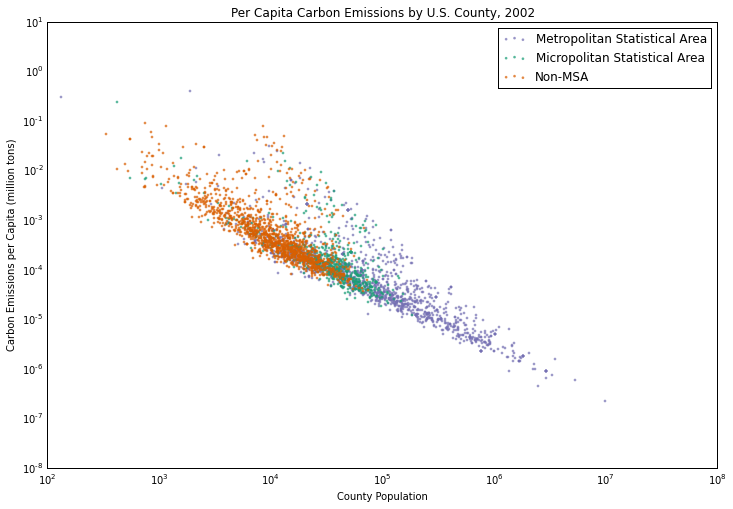

Clarity：
Generally, the plot is easy to read.
The plots reflect the relationship between carbon emission and the population of county.
The x axis doesn’t have a proper unit. 

Esthetic:
There are 3 types of colors represent 3 types of counties. The chosen color is totally different from each other, making it clear to normal people. However, since the colors are close in terms of saturation, it might be a little bit difficult for color-blind people to verify.

Honesty: 
According to the plot, most metropolitan statistics areas have lower carbon emission and higher population, while most non-MSA areas have higher carbon emission and lower population.  

Suggestion:
1.Add the unit of x axis.
2.Verify the saturation of the 3 colors or use the size of dots to verify the difference.
