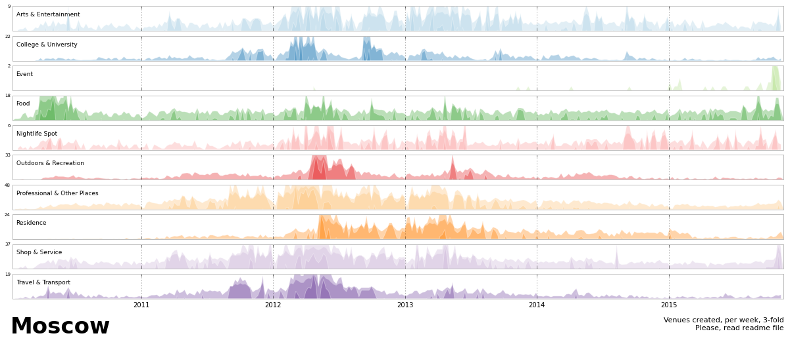

Clarity：
Generally, the plot is easy to read.
The plot represents the construction tendency of different venues during the recent years.
However, the title of the plot cannot represent the information directly.
It is difficult to understand the meaning of 3-fold.
 
Esthetic:
The different types of venues created in recent years are verified by colors. The colors with similar saturation may not be easy for color-blind people to judge. Since each column only has a one color, it is not a big problem.

Honesty: 
The plot is the agglomeration of several time series. To find out the similar tendency, the y axis has been adjusted to make the changes obvious.  However, because of the adjustment, the degree of change tendency can not be reflected in the plot.

Suggestion:  
1.Change the title to ‘Time Series of Venues Construction in Moscow (3-fold)’   
2.Add a unit of y axis  
3.Change the y axis to the same measurement units.
