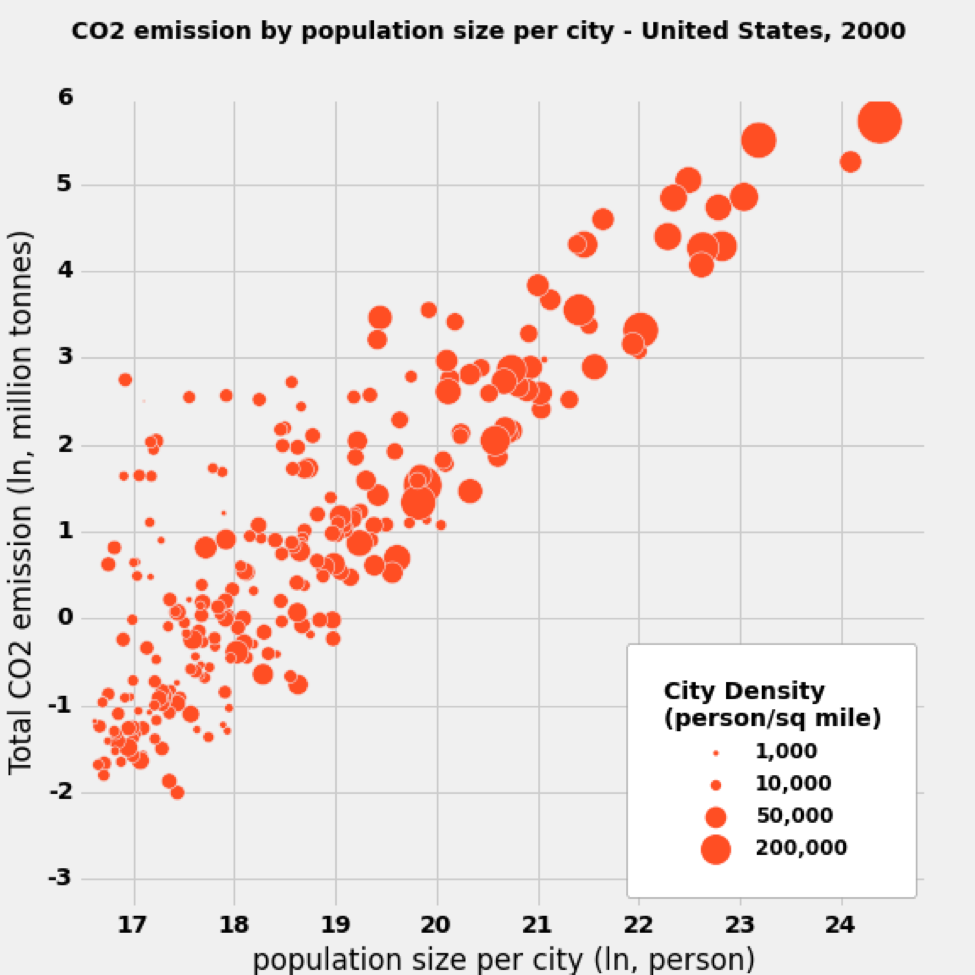

Clarity：
Generally, the plot is easy to read.
The plot reflects the relationship between total CO2 emission (ln, million tones) and population size per city (ln, person) with proper title and legend.

Esthetic:
The city density (person/sq miles) are shown by the size of dots, which is not only clear for normal people, but also clear for color-blind people. The quantity of population each size represents are also methodically labelled in the legend with title and unit.

Honesty:
Taking the logarithmic result of both x axis and y axis data makes the plots easier and clearer to be judged.  So the plot reflects the data honestly.

Suggestion:
The plot is clear in all aspects and reflects all 3 dimensional information (total CO2 emission, city density, population size per city).  
1.Labelling the names a few cities with high value of carbon emission or population size may help people quickly find out the special sample.  
2.The color could be different among 0-1000, 1000-10000, 10000-50000, 50000-200000, which makes the difference easy to verify.
